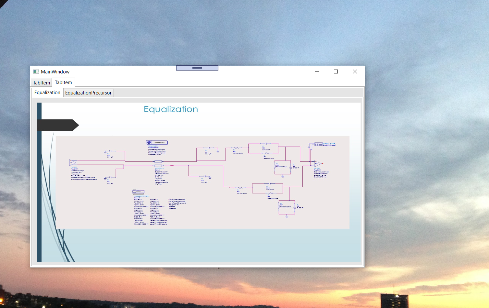
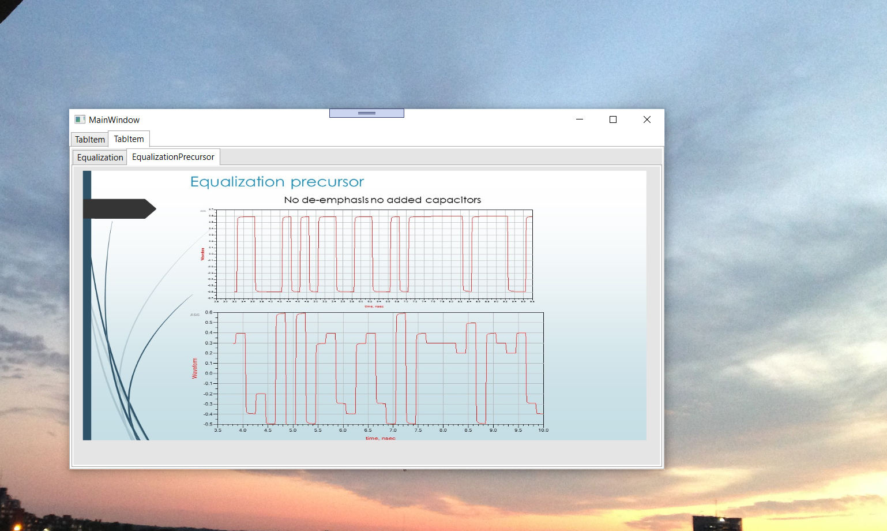
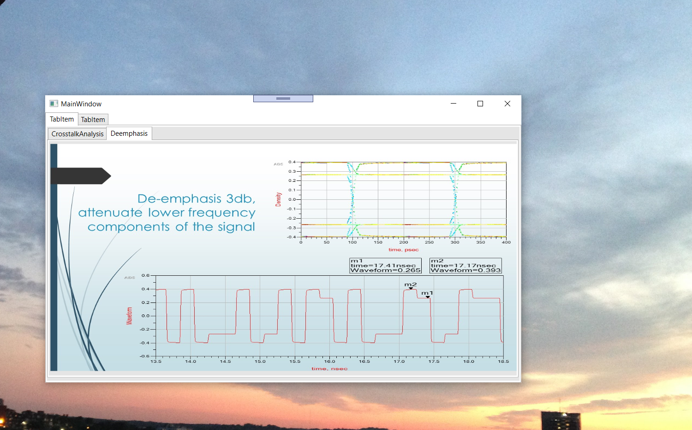
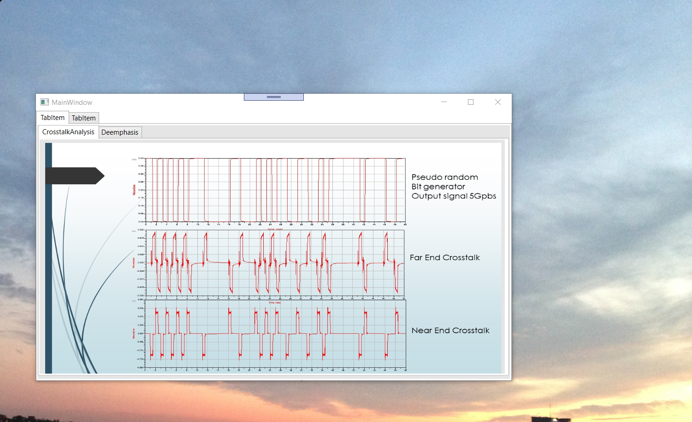

# PCB Signal Integrity EEM

The project provides on overview on transmission wave theory and signal integrity analysis

Please click on the executable located in https://github.com/alpaddesai/PCBSignalIntegrity_EEM/releases for details. 
All images are custom or have a reference name.

## Equalization 

## Equalization Precursor 

## De-emphasis Analysis

## Crosstalk Analysis

