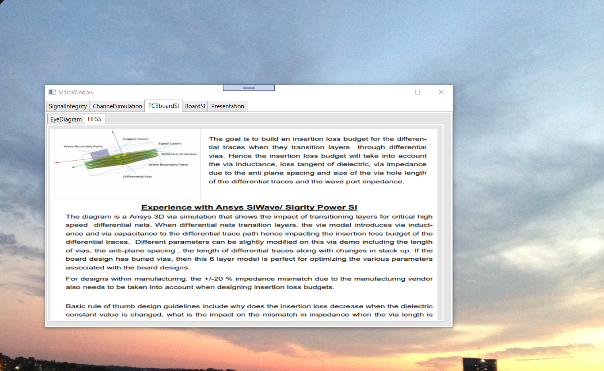

# PCB Signal Integrity EEM Devices 2015

The project provides on overview on transmission wave theory and signal integrity analysis

Please click on the executable located in https://github.com/alpaddesai/PCBSignalIntegrity_EEM/releases for details. 
All images are custom or have a reference name.

## Equalization 

## Equalization Precursor 

## De-emphasis Analysis

## Crosstalk Analysis

## PCB Board Signal Integrity

## HFSS - Experience 2015

## Board Signal Integrity

## Material

## Material 

## Material

## Simulations and Performance Metrics

## Ethics and Integrity

Advamced knowledge reference : https://github.com/alpaddesai/TechnicalProjectManagement2022
